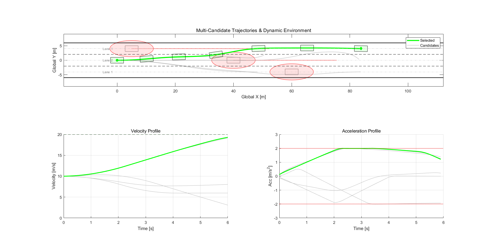

# ADMM-iLQR Autonomous Driving Motion Planner (MATLAB)

This is a MATLAB-based motion planning library for autonomous driving. The core algorithm uses a Constrained Iterative Linear Quadratic Regulator (iLQR) based on the Alternating Direction Method of Multipliers (ADMM). It efficiently handles nonlinear vehicle dynamics, obstacle avoidance constraints, and control limits.

This project covers the complete pipeline from candidate trajectory generation and parallel optimization to closed-loop simulation.

## ✨ Features

- **ADMM-iLQR Optimizer**: Integrates hard constraints (e.g., obstacle avoidance, road boundaries, control limits) into the iLQR solver framework using ADMM for efficient constraint handling.
- **Multimodal Parallel Planning**: Adopts "Parallel Homotopic Trajectory Optimization" to simultaneously generate and optimize multiple candidate trajectories (e.g., Lane Keeping, Lane Change Left/Right, Car Following, Stopping), utilizing `parfor` for parallel acceleration.
- **Analytical Longitudinal Planning**: A Time-Optimal, Jerk-Limited Solver generates high-quality warm starts for the optimizer based on jerk limits.
- **Closed-Loop Simulation Environment**: Includes a simple traffic flow generator and a closed-loop controller to verify algorithm stability over long horizons.

## 🖼️ Gallery & Results

### Single-Frame Optimization Result



> _Figure 1: Visualization of parallel optimization for multiple candidate trajectories in a dynamic environment._

### Closed-Loop Simulation


> _Figure 2: Closed-loop simulation demonstrating dynamic obstacle avoidance and traffic flow management._

## 🛠️ Requirements

- MATLAB R2020b or later
- **Parallel Computing Toolbox** (Required for parallel computing in `main_ADMM_iLQR.m`. If not installed, change `parfor` loops to standard `for` loops in the code).
    

## 🚀 Quick Start

Download or clone this repository and add the root directory to your MATLAB path.

### 1. Single Frame Planning Demo

Run the `main_ADMM_iLQR.m` script to test planning for a single frame.

Matlab

```
>> main_ADMM_iLQR
```

**Functionality:**

- Initializes a three-lane scenario with static and dynamic obstacles.
- Generates candidate trajectories with various behavioral intentions (Cruising, Following, Stopping, Lane Change).
- **Parallely** optimizes all candidate trajectories.
- Scores and selects the best trajectory based on safety, comfort, and progress.
- **Output**: Plots results showing all candidates, the optimal trajectory, obstacle predictions, and velocity/acceleration profiles.
    

### 2. Closed-Loop Simulation

Run the `run_closed_loop_simulation.m` script to perform a continuous closed-loop simulation.

Matlab

```
>> run_closed_loop_simulation
```

**Functionality:**

- Starts a time-stepping simulation loop (Default T=5.0s, adjustable).
- **Physics Update**: Updates the ego vehicle state and obstacle positions (simulating the physical environment).
- **Traffic Management**: Dynamically removes distant vehicles and spawns new ones to maintain traffic density.
- **Perception & Prediction**: Generates simple trajectory predictions for obstacles.
- **Planning & Control**: Calls the ADMM-iLQR planner to calculate control commands.
- **Output**: Plays an animation of the simulation process upon completion, with an option to save it as a video.
    

## 📂 File Structure

- `admm_ilqr/`
    - `main_ADMM_iLQR.m`: **[Entry Point]** Main script for single-frame planning.
    - `run_closed_loop_simulation.m`: **[Entry Point]** Main script for closed-loop simulation.
    - `run_admm_ilqr.m`: Core logic for the ADMM-iLQR algorithm (Algorithm 1).
    - `run_iLQR_admm_wrapper.m`: The iLQR iterative solver.
    - `project_constraints_*.m`: Implementations for various constraint projections (Euclidean, Ray-Casting, Stable Reference, etc.).
    - `generate_candidates_structured.m`: Candidate trajectory generation based on semantic intentions.
    - `target_velocity_solver.m` & `target_position_solver.m`: Analytical solvers for longitudinal planning.
    - `evaluate_trajectories.m`: Logic for trajectory scoring and decision-making.
        

## 📚 References

The core algorithm implementation in this project is based on the following academic papers:

1. Ma, Jun, et al. "Alternating direction method of multipliers for constrained iterative LQR in autonomous driving." IEEE Transactions on Intelligent Transportation Systems 23.12 (2022): 23031-23042.
    
    - _Describes how to use the ADMM framework to solve general constraint problems within iLQR._
        
2. Zheng, Lei, et al. "Barrier-enhanced parallel homotopic trajectory optimization for safety-critical autonomous driving." IEEE Transactions on Intelligent Transportation Systems (2024).
    
    - _Introduces the method of simultaneously optimizing multiple homotopic trajectories using parallel computing and related obstacle avoidance strategies._
        
3. Haschke, Robert, Erik Weitnauer, and Helge Ritter. "On-line planning of time-optimal, jerk-limited trajectories." 2008 IEEE/RSJ International Conference on Intelligent Robots and Systems. IEEE, 2008.
    
    - _Provides an analytical method for generating smooth, jerk-limited longitudinal trajectories (used for warm starts)._
        

## 📄 License

See the LICENSE file for details.
